# TikZducks

[](http://www.latex-project.org/lppl.txt)
[](https://github.com/samcarter/tikzducks/releases/latest)
[](https://ctan.org/pkg/tikzducks)

This is a little LaTeX package for ducks to be used in TikZ pictures. The project is a continuation of the TeX.Stackexchange.com answer [How can we draw a duck](https://tex.stackexchange.com/a/347458/36296)

A big thank you to all the people who contributed with code, ideas or feedback to the package! Without this package would not exist!

## Usage

A short example to demonstrate the use of the TikZducks:

```latex
\documentclass{standalone}
\usepackage{tikzducks}

\begin{document}
	
\begin{tikzpicture}
	\duck[
		% add options here, e.g.
		lightsaber
	]
\end{tikzpicture}	
	
\end{document}
```

An exhaustive list of possible options can be found in [package documentation](./documentation.pdf)

## Examples

Below are some examples of ducks created with the TikZducks package. Click on the images to see their source code.

In case you would like to share some of your ducks with the community, I would be happy to accept pull requests or simply open an issue in the bug tracking system.

<!--
<a href="./duckpond/.tex"></a>
-->

### Duckifications

<a href="./duckpond/Arthur.tex"></a>
<a href="./duckpond/Hilbert.tex"></a>
<a href="./duckpond/Knuth.tex"></a>
<a href="./duckpond/PaulinoVanDuck.tex"></a>
<a href="./duckpond/QueenDuck.tex"></a>
<a href="./duckpond/DuckInBlack.tex"></a>
<a href="./duckpond/JamesDuck.tex"></a>
<a href="./duckpond/MaryDuckings.tex">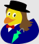</a>
<a href="./duckpond/MayTheQuackBeWithYou.tex">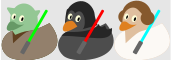</a>
<a href="./duckpond/Peppone.tex"></a>
<a href="./duckpond/PrincessDuck.tex"></a>
<a href="./duckpond/SuperDuckBrothers.tex"></a>
<a href="./duckpond/QuackLongAndProsper.tex"></a>
<a href="./duckpond/StarDucks.tex">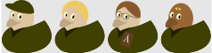</a>
<a href="./duckpond/DuckWho.tex"></a>
<a href="./duckpond/Phantom.tex"></a>

### Ducks in History

<a href="./duckpond/Ceasar.tex">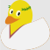</a>
<a href="./duckpond/RomanDuck.tex"></a>
<a href="./duckpond/Viking.tex"></a>
<a href="./duckpond/Pythagoras.tex">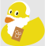</a>
<a href="./duckpond/Geisha.tex">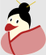</a>
<a href="./duckpond/Vietnam.tex">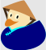</a>
<a href="./duckpond/Knight.tex"></a>
<a href="./duckpond/Shakespeare.tex"></a>

### Ducks in Art

<a href="./duckpond/MonaDuck.tex">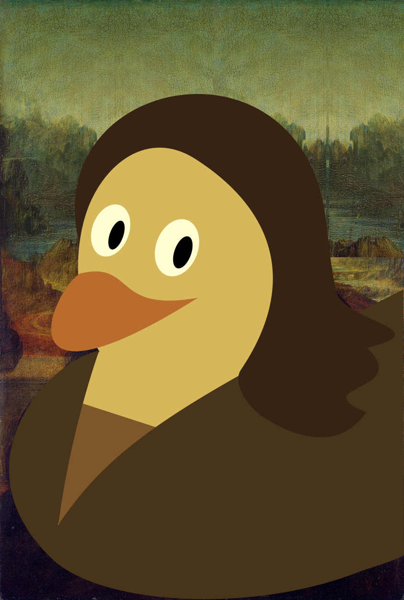</a>
<a href="./duckpond/GirlWithPearlEarring.tex">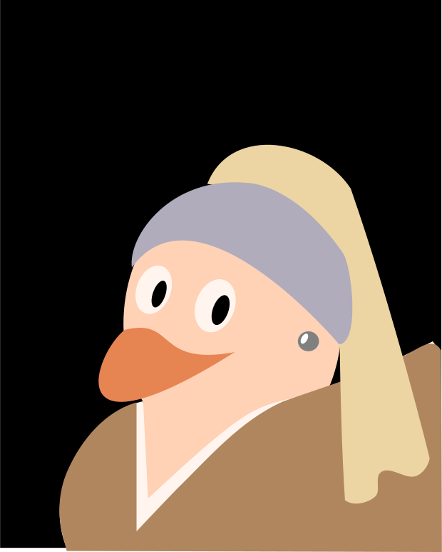</a>
<a href="./duckpond/PopArt.tex">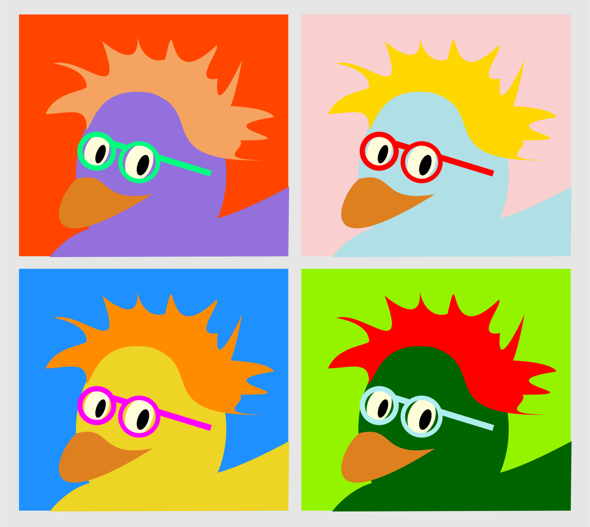</a>
<a href="./duckpond/Leonardo.tex">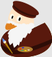</a>
<!--<a href="./duckpond/Monet.pdf">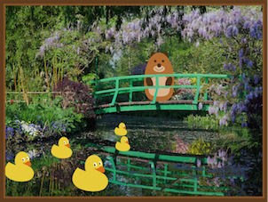</a>-->
<a href="./duckpond/Soup.tex">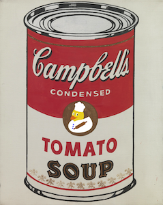</a>
<a href="./duckpond/Frida.tex">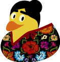</a>

### TeX.SE users (and relatives)

<a href="./duckpond/CarLaTeX.tex"></a>
<a href="./duckpond/Ulrike.tex">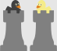</a>
<a href="./duckpond/Gert.tex">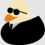</a>
<a href="./duckpond/Paulo.tex">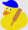</a>
<a href="./duckpond/Manooooh.tex">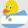</a>
<a href="./duckpond/Samcarter.tex">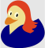</a>

### Professions and Occupation

<a href="./duckpond/AirDuck.tex"></a>
<a href="./duckpond/AstroDuck.tex"></a>
<a href="./duckpond/Chef.tex"></a>
<a href="./duckpond/ClergyDucks.tex"></a>
<a href="./duckpond/DuckMD.tex"></a>
<a href="./duckpond/DuckScout.tex"></a>
<a href="./duckpond/QueensSwanUpper.tex"></a>
<!--<a href="./duckpond/Surfer.svg">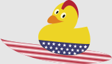</a>-->
<a href="./duckpond/Ghost.tex"></a>
<a href="./duckpond/Harlequin.tex"></a>
<a href="./duckpond/Jailbird.tex"></a>
<a href="./duckpond/Chainsaw.tex"></a>
<a href="./duckpond/Devil.tex"></a>
<a href="./duckpond/Ninja.tex"></a>
<a href="./duckpond/PartyDuck.tex">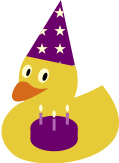</a>
<a href="./duckpond/Vampire.tex"></a>
<a href="./duckpond/Snowduck.tex"></a>
<a href="./duckpond/OfficeDuck.tex">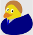</a>
<a href="./duckpond/SailorDuck.tex"></a>
<a href="./duckpond/DuckHug.tex">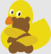</a>

### Animals and Beings

<a href="./duckpond/AraraDuck.tex">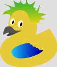</a>
<a href="./duckpond/BeeDuck.tex">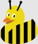</a>
<a href="./duckpond/Bunny.tex"></a>
<a href="./duckpond/Donkey.tex"></a>
<a href="./duckpond/Horse.tex">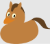</a>
<a href="./duckpond/Pig.tex">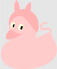</a>
<a href="./duckpond/Sheep.tex"></a>
<a href="./duckpond/Zebra2.tex">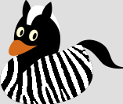</a>

### More ducks

<a href="./duckpond/3Dduck.tex">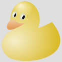</a>
<a href="./duckpond/Back.tex"></a>
<a href="./duckpond/Churyumov-Gerasimenko.tex">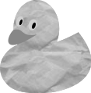</a>
<a href="./duckpond/Brazil.tex">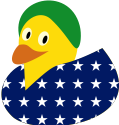</a>
<a href="./duckpond/FrenchDuck.tex"></a>
<a href="./duckpond/YankeeDuck.tex">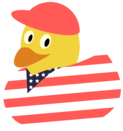</a>
<a href="./duckpond/Facemask.tex">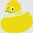</a>
<!--<a href="./duckpond/Chess.tex">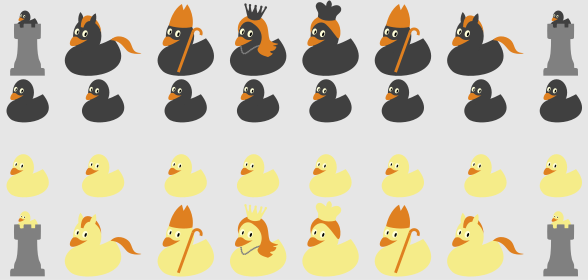</a>
<a href="./duckpond/Vikings.tex">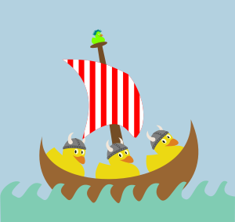</a>
<a href="./duckpond/GreatWall.tex">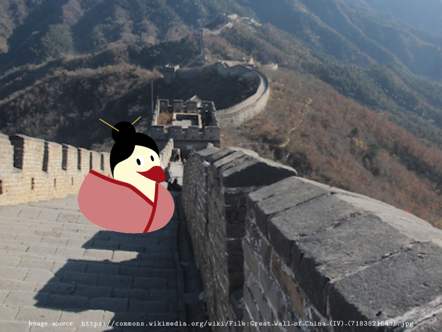</a>
<a href="./duckpond/Ferragosto.svg">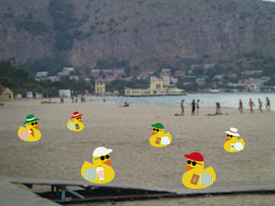</a>


<a href="./duckpond/Pacduck.tex">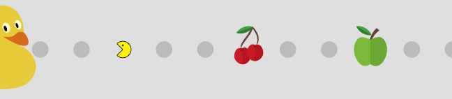</a>-->


## TikZducks movies

There are several videos featuring the TikZducks, kindly contributed by Ulrike and Gert Fischer, Carla Maggi, Paulo Cereda and Marmot - many thanks to you all!

<a href="https://vimeo.com/246256860"></a>
<a href="https://vimeo.com/254643482"></a>
<a href="https://vimeo.com/252719006"></a>
<a href="https://vimeo.com/270727100"></a>
<a href="https://vimeo.com/295353434"></a>
<a href="https://vimeo.com/284348495"></a>
<a href="https://vimeo.com/305374856"></a>
<a href="https://vimeo.com/337320777"></a>
<a href="https://vimeo.com/380684973"></a>
<a href="https://vimeo.com/492532561"></a>

The source code for some of the movies is available from [TikZlings@github](https://github.com/TikZlings/).
